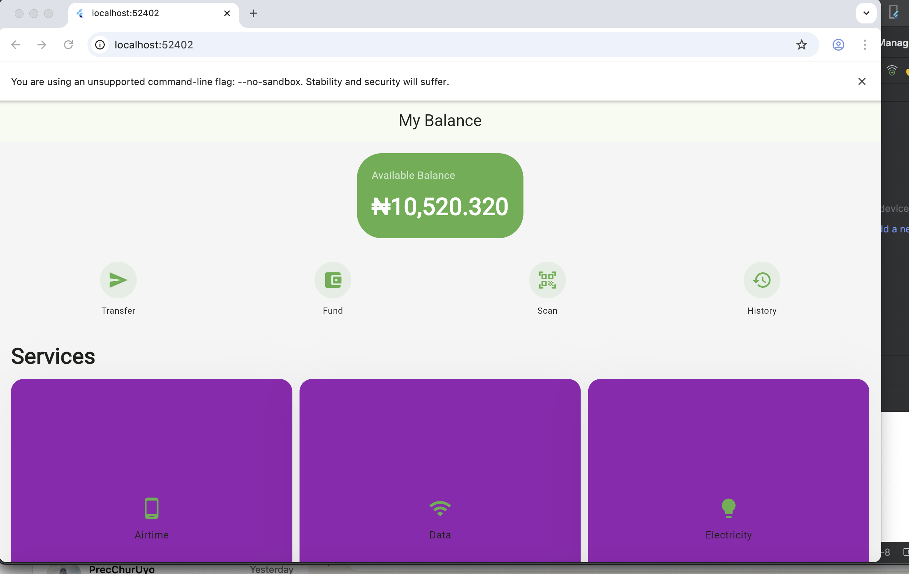
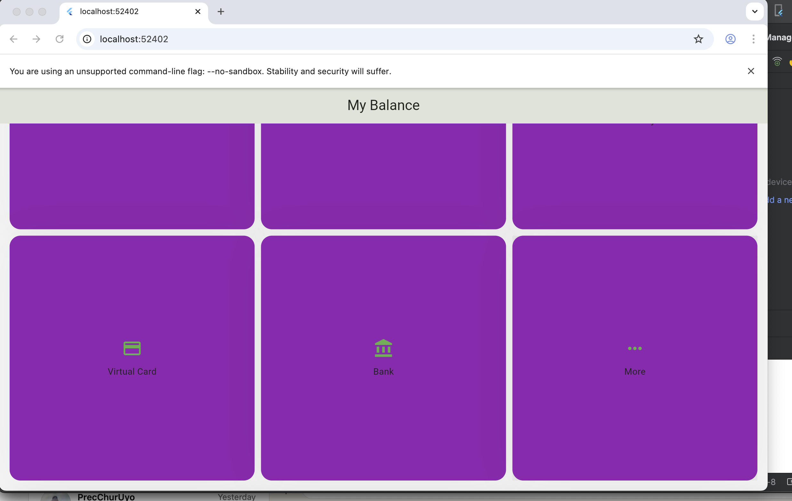

# OPAY_PROJECT
---

💰 OPay Interface with Flutter

Built with Flutter & Dart | Cross-Platform UI

This project is a UI recreation inspired by the OPay mobile application, developed using Flutter.
Rather than copying functionality, the focus is on visual layout, screen transitions, and adaptive UI behavior across various devices.

It serves as a hands-on practice project for building structured, scalable Flutter interfaces that resemble real-world fintech apps.

	⁠🚫 Notice
This repository has no connection to OPay or its services.
It exists solely for educational use and personal portfolio presentation.

---

🖼️ Visual Demonstration

A sample dashboard layout featuring balance display, shortcut actions, service tiles, and navigation controls.

layout: 
 
 
 

---

📌 What’s Inside

UI Capabilities

Tools & Technologies

File Organization

Local Setup Guide

Purpose of the Project

Legal Information

---

🎨 UI Capabilities

Dashboard-style landing screen inspired by fintech apps

Balance display card with interactive buttons

Separate pages for transfers, finances, rewards, and cards

Transaction activity screen

Persistent bottom navigation system

Adaptive layouts for different screen dimensions

Straightforward routing and screen management

---

🧰 Tools & Technologies

UI Framework: Flutter

Programming Language: Dart

Design System: Material Design

Target Platforms

Android

iOS

Web browsers

Windows

Linux

macOS

---

🗂️ File Organization

The codebase is structured around individual screens for easier readability and maintenance:

lib/
└── main.dart                 # App

---

🧪 Running the App

Environment Setup

Before running the project, ensure you have:

Flutter SDK installed

Dart SDK available

An IDE (Android Studio or VS Code)

A simulator or real device

Getting Started

git clone [https://github.com/Gods-Peare/OPAY_PROJECT/edit/main]
flutter pub get
flutter run

Platform-Specific Execution

flutter run -d chrome     # Web
flutter run -d windows    # Windows
flutter run -d linux      # Linux
flutter run -d android    # Android

---

🎯 Why This Project Exists

This build was created to:

Strengthen Flutter UI development skills

Practice layout composition used in fintech apps

Explore responsive design techniques

Showcase Flutter capabilities in a portfolio

---

📄 License Information

Released under the MIT License.
This project may be reused or modified strictly for non-commercial learning purposes.

---

👤 Developer

Godspower Johnson
Flutter UI Developer
